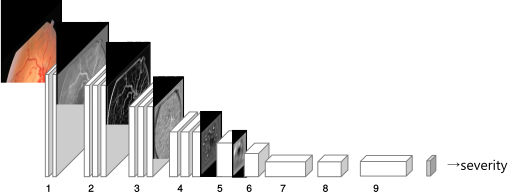

# Kaggle Diabetic Retinopathy Detection

This is a CNN detector for the Kaggle DR dataset. It takes retinal fundus photography as input,
and predicts DR severity (0-4).


### Origin and Network Archiecture

This project is derived from 
[sveitser/kaggle_diabetic](https://github.com/sveitser/kaggle_diabetic), which 
was team o_O's solution for the [Kaggle Diabetic Retinopathy Detection Challenge](https://www.kaggle.com/c/diabetic-retinopathy-detection).

The original implementation relies on Python2 and some obsoleted deep learning 
frameworks. I have modified it so that it can be run on Python3 + keras + tensorflow
frameworks. Please note that this implementation is different from the original on 
several points:

1. The left eye and right eye are discoupled and used as separate training sample.
2. The original blending procedure has not been implemented.

Please Refer to [the original solution report](doc/original_report.pdf) for
more information on the network and training architecture. 



### Reqirements

This project is built on Python3 + Tensorflow1.x and Keras2.x. The exact dependencies are listed in `requirements.txt`.
```shell script
pip3 install -r requirements.txt
```

### Dataset Preparation

Download [Kaggle DR dataset](https://www.kaggle.com/c/diabetic-retinopathy-detection)
and extract train/test images to `data/train` and `data/test` respectively, and
put the `trainLabels.csv` and `retinopathy_solution.csv` label file into the `data` directory as well.

convert.py will do center-cropping and resizing to the original Kaggle dataset. The o_O
solution require training images of 3 different sizes, 512x512, 256x256 and 128x128.

```shell script
python3 convert.py --crop_size 512 --convert_directory data/train_medium --extension jpg --directory data/train
python3 convert.py --crop_size 512 --convert_directory data/test_medium --extension jpg --directory data/test

python3 convert.py --crop_size 256 --convert_directory data/train_small --extension jpg --directory data/train_medium
python3 convert.py --crop_size 128 --convert_directory data/train_tiny --extension jpg --directory data/train_medium
```

### Start Training

The convolutional network configuration is done via the files in the `configs` directory. You
can change parameters such as learning rate, batch size, and can also modify the network.

The o_O solution first trains model of smaller input images, and use them to initalize
models of larger input images. For example runing these lines to get a 512_4x4_32 model:
```shell script
# Train network with 4x4 kernels.
python3 train_nn.py --cnf configs/c_128_4x4_32.py
python3 train_nn.py --cnf configs/c_256_4x4_32.py --weights_from weights/c_128_4x4_32/weights.h5
python3 train_nn.py --cnf configs/c_512_4x4_32.py --weights_from weights/c_256_4x4_32/weights.h5
```

After training, you can find a best-val_kappa model weight at `weights/c_512_4x4_32/weights.h5`.

A pretrained model can be found here: [
o_O-DR-detector-c_512_4x4_32.h5](https://drive.google.com/open?id=1OI1d3XWM7IyW2igIEq8s-ZyF9vw0vTiw).

### Evalation

Run `eval_nn.py` to get the performance of a model on the Kaggle test set.
```shell script
python3 eval_nn.py --cnf configs/c_512_4x4_32.py --weights_from weights/c_512_4x4_32/weights.h5
```

Example output:
```
kappa:  0.77537376
accuracy: 0.7821039271315514
             precision    recall  f1-score   support

          0       0.90      0.91      0.90     39533
          1       0.17      0.27      0.21      3762
          2       0.72      0.52      0.60      7861
          3       0.34      0.44      0.39      1214
          4       0.83      0.35      0.49      1206

avg / total       0.81      0.78      0.79     53576
```

### Testing

Run `test_nn.py` to get predicted labels on user-designated images. For example you've put the resized images into
a `path_to_test_images/` directory, run
```shell script
python3 test_nn.py --cnf configs/c_512_4x4_32.py --weights_from weights/c_512_4x4_32/weights.h5 --input_dir path_to_test_images/
```

Example output:
```
mytest/10000_left.jpg   [0.40482914]
mytest/10011_left.jpg   [0.1490646]
mytest/10011_right.jpg  [0.11659312]
mytest/10034_left.jpg   [0.07668847]
mytest/10038_right.jpg  [0.16606224]
mytest/10063_left.jpg   [0.1838963]
mytest/10063_right.jpg  [0.13100296]
mytest/10071_left.jpg   [0.17895216]
mytest/1007_left.jpg    [0.10336971]
mytest/10091_right.jpg  [2.040517]
```

### Research Paper

This project is part of the interpretability research. If it helps your research, 
please consider citing our paper:

```bibtex
@inproceedings{niu2019pathological,
  title={Pathological Evidence Exploration in Deep Retinal Image Diagnosis},
  author={Niu, Yuhao and Gu, Lin and Lu, Feng and Lv, Feifan and Wang, Zongji and Sato, Imari and Zhang, Zijian and Xiao, Yangyan and Dai, Xunzhang and Cheng, Tingting},
  booktitle={Proceedings of the AAAI conference on artificial intelligence},
  volume={33},
  pages={1093--1101},
  year={2019}
}
```

